# 📊 MEAL Impact Analysis Dashboard — R (ggplot2)

> **Auteur :** NABALOUM Emile | emi.nabaloum@gmail.com  
> **Stack :** R (tidyverse · ggplot2 · patchwork · broom · ggtext)  
> **Figures :** 13 visualisations de qualité publication  
> **Contexte :** Analyse MEAL sur des programmes humanitaires au Sahel (2023–2024)
 
---

## 📌 Overview

Ce projet présente une analyse **Monitoring, Evaluation, Accountability and Learning (MEAL)** complète à partir de 4 jeux de données réalistes issus de programmes humanitaires au Sahel.

| Dataset                    | Lignes   | Description |
|---------------------------|----------|-----------|
| `indicators.csv`          | 480      | KPIs par secteur, pays et bailleur |
| `beneficiaries.csv`       | 1 200    | Registre des bénéficiaires |
| `nutrition_screening.csv` | 800      | Données cliniques de nutrition (MUAC, poids, taille) |
| `accountability.csv`      | 400      | Mécanisme de plainte et redevabilité (CRM) |

---

## 📈 Analyses & Visualisations

### Section 1 — Performance des Indicateurs

#### Figure 01 — Taux de réalisation moyen par secteur

**Analyse :** Taux de réalisation moyen par secteur avec seuil cible à 80 %.

```r
sector_perf <- indicators %>%
  group_by(Sector) %>%
  summarise(mean_achievement = mean(AchievementRate, na.rm = TRUE), .groups = "drop") %>%
  arrange(desc(mean_achievement))

p1 <- ggplot(sector_perf, 
             aes(x = reorder(Sector, mean_achievement),
                 y = mean_achievement,
                 fill = mean_achievement)) +
  geom_col(width = 0.7, show.legend = FALSE) +
  geom_hline(yintercept = 0.80, linetype = "dashed", color = "#E74C3C", linewidth = 0.7) +
  geom_text(aes(label = percent(mean_achievement, accuracy = 1)),
            hjust = -0.15, size = 3.5, fontface = "bold") +
  scale_y_continuous(labels = percent_format(), limits = c(0, 1.05)) +
  scale_fill_gradient(low = "#74C69D", high = "#1B4332") +
  coord_flip() +
  labs(title = "Average Achievement Rate by Sector",
       subtitle = "Ligne rouge pointillée = seuil cible de 80%",
       caption = "Source: Programme Indicator Tracking System",
       x = NULL, y = "Achievement Rate (%)") +
  theme_meal()

save_fig(p1, "01_sector_achievement", w = 9, h = 5.5)
```
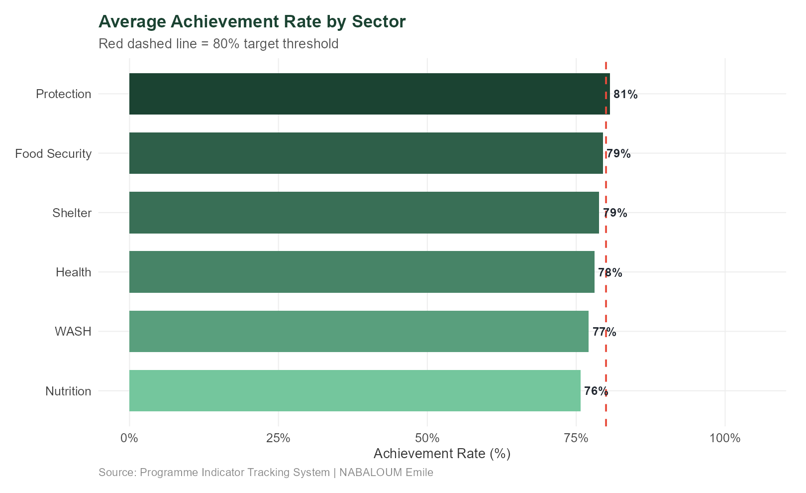


#### Figure 02 — Heatmap Taux de réalisation (Pays × Secteur)
```r
Rheatmap_data <- indicators %>%
  group_by(Country, Sector) %>%
  summarise(mean_achievement = mean(AchievementRate, na.rm = TRUE), .groups = "drop")

p2 <- ggplot(heatmap_data, aes(x = Sector, y = Country, fill = mean_achievement)) +
  geom_tile(color = "white", linewidth = 0.8) +
  geom_text(aes(label = percent(mean_achievement, accuracy = 1)),
            size = 3.2, fontface = "bold",
            color = ifelse(heatmap_data$mean_achievement > 0.65, "white", "#222831")) +
  scale_fill_gradient2(low = "#E74C3C", mid = "#F39C12", high = "#27AE60",
                       midpoint = 0.70, labels = percent_format()) +
  labs(title = "Achievement Rate Heatmap — Country × Sector",
       subtitle = "Vert = performant | Jaune = à risque | Rouge = en retard",
       caption = "Source: Programme Indicator Tracking System",
       x = NULL, y = NULL) +
  theme_meal() +
  theme(axis.text.x = element_text(angle = 35, hjust = 1))

save_fig(p2, "02_achievement_heatmap", w = 10, h = 5)
```
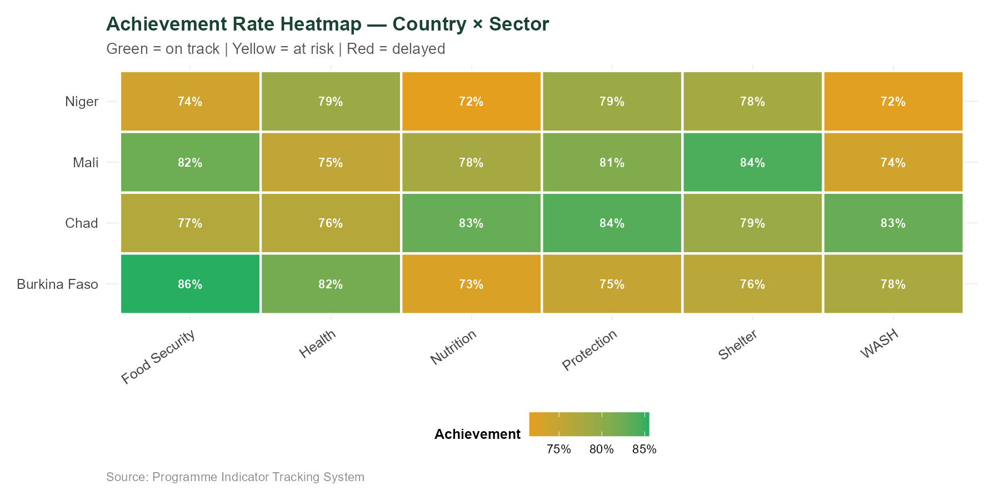

#### Figure 03 — Évolution trimestrielle des indicateurs
```r
Rtrend_data <- indicators %>%
  group_by(Year, Quarter, Sector) %>%
  summarise(mean_ach = mean(AchievementRate, na.rm = TRUE), .groups = "drop")

p3 <- ggplot(trend_data, aes(x = Quarter, y = mean_ach, color = Sector, 
                             group = interaction(Year, Sector), 
                             linetype = factor(Year))) +
  geom_line(linewidth = 0.9) +
  geom_point(size = 2.5) +
  geom_hline(yintercept = 0.80, linetype = "dotted", color = "#E74C3C") +
  scale_y_continuous(labels = percent_format(), limits = c(0.3, 1.05)) +
  scale_x_continuous(breaks = 1:4, labels = paste0("Q", 1:4)) +
  labs(title = "Quarterly Achievement Trend by Sector (2023–2024)",
       subtitle = "Ligne pointillée rouge = seuil de 80%",
       x = "Quarter", y = "Achievement Rate (%)") +
  facet_wrap(~Sector, ncol = 3) +
  theme_meal() +
  theme(legend.position = "none")

save_fig(p3, "03_quarterly_trend", w = 12, h = 7)
```
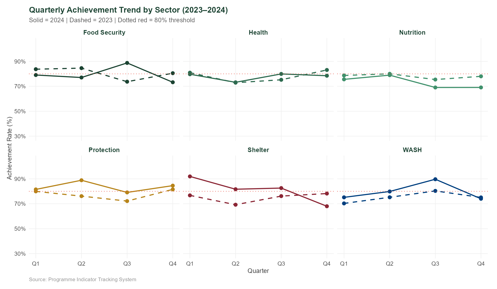

#### Section 2 — Démographie des Bénéficiaires

#### Figure 04 — Répartition Vulnérabilité × Genre (diverging bars)

```r
Rvuln_gender <- beneficiaries %>%
  count(VulnType, Gender) %>%
  mutate(n_display = ifelse(Gender == "Male", -n, n))

p4 <- ggplot(vuln_gender, aes(x = n_display, y = reorder(VulnType, abs(n_display)), fill = Gender)) +
  geom_col(width = 0.65) +
  geom_vline(xintercept = 0, color = "white", linewidth = 0.8) +
  geom_text(aes(label = comma(abs(n_display)), 
                hjust = ifelse(Gender == "Male", 1.15, -0.15)),
            size = 3.2) +
  scale_x_continuous(labels = function(x) comma(abs(x))) +
  scale_fill_manual(values = PAL_GENDER) +
  labs(title = "Beneficiary Population by Vulnerability Type and Gender",
       subtitle = "Homme à gauche | Femme à droite",
       x = "Nombre de bénéficiaires", y = NULL, fill = "Gender") +
  theme_meal()

save_fig(p4, "04_vulnerability_gender", w = 10, h = 5.5)

```
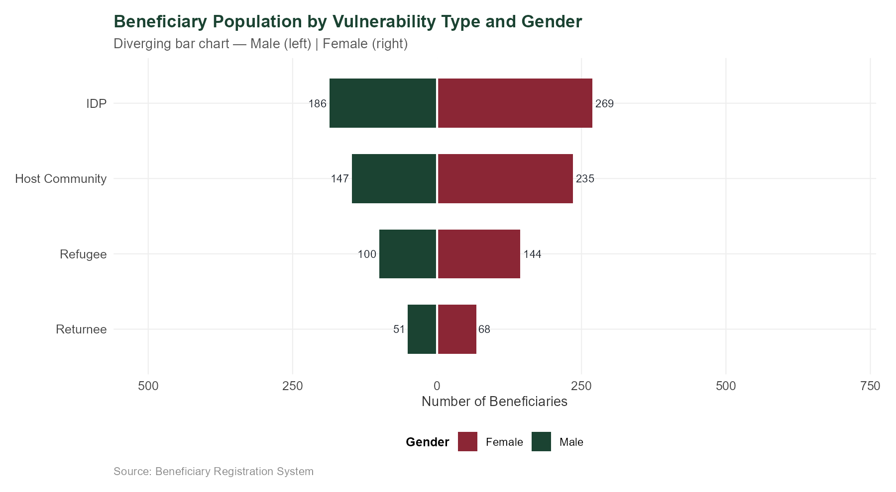

#### Figure 05 — Pyramide des âges par genre

```r
Rpyramid_data <- beneficiaries %>%
  count(AgeGroup, Gender) %>%
  mutate(n_plot = ifelse(Gender == "Male", -n, n))

p5 <- ggplot(pyramid_data, aes(x = n_plot, y = AgeGroup, fill = Gender)) +
  geom_col(width = 0.65) +
  geom_vline(xintercept = 0, color = "white", linewidth = 1) +
  geom_text(aes(label = comma(abs(n_plot)),
                hjust = ifelse(Gender == "Male", 1.2, -0.2)),
            size = 3.5) +
  scale_x_continuous(labels = function(x) comma(abs(x))) +
  scale_fill_manual(values = PAL_GENDER) +
  labs(title = "Beneficiary Age-Gender Pyramid",
       x = "Nombre de bénéficiaires", y = "Groupe d'âge", fill = "Gender") +
  theme_meal()

save_fig(p5, "05_age_gender_pyramid", w = 9, h = 5)

```
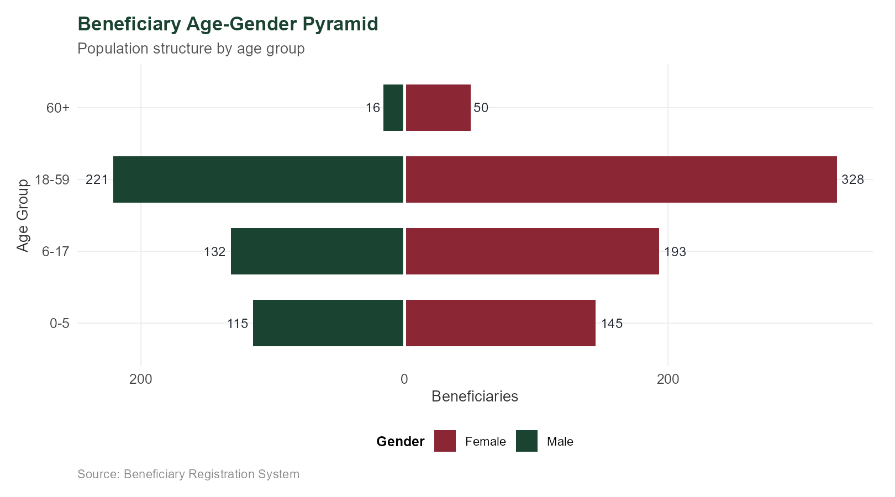

#### Figure 06 — Évolution mensuelle des inscriptions (LOESS)

```r
Rmonthly_reg <- beneficiaries %>%
  count(RegYearMonth, Sector) %>%
  group_by(Sector) %>%
  mutate(rolling_avg = zoo::rollmean(n, k = 3, fill = NA, align = "right"))

p6 <- ggplot(monthly_reg, aes(x = RegYearMonth, y = n, color = Sector)) +
  geom_line(alpha = 0.35) +
  geom_smooth(method = "loess", se = TRUE, span = 0.5, linewidth = 1.2, alpha = 0.15) +
  scale_x_date(date_labels = "%b %Y", date_breaks = "3 months") +
  labs(title = "Monthly Beneficiary Registrations by Sector",
       subtitle = "Lignes = données brutes | Bandes = lissage LOESS",
       x = NULL, y = "Nouvelles inscriptions") +
  facet_wrap(~Sector, ncol = 3, scales = "free_y") +
  theme_meal() +
  theme(axis.text.x = element_text(angle = 45, hjust = 1))

save_fig(p6, "06_registration_trend", w = 13, h = 7)

```
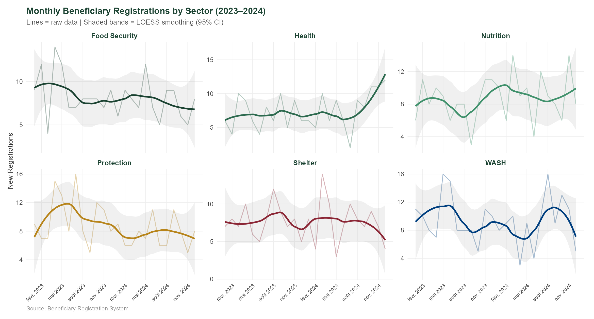

#### Section 3 — Analyse Nutritionnelle
#### Figure 07 — Distribution MUAC selon le statut nutritionnel

```r
Rp7 <- ggplot(nutrition, aes(x = MUAC_cm, fill = NutritionStatus)) +
  geom_histogram(binwidth = 0.5, color = "white", alpha = 0.85, position = "identity") +
  geom_vline(xintercept = c(11.5, 12.5), linetype = "dashed", color = "#222831") +
  scale_fill_manual(values = PAL_NUTR) +
  labs(title = "MUAC Distribution by Nutrition Status",
       subtitle = "Seuils OMS : SAM < 11.5 cm | MAM 11.5–12.5 cm | Normal > 12.5 cm",
       x = "MUAC (cm)", y = "Nombre de cas") +
  theme_meal()

save_fig(p7, "07_muac_distribution", w = 10, h = 5.5)

```
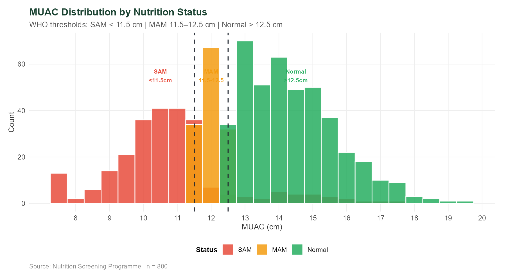

#### Figure 08 — Taux de SAM par pays et par année

```r
Rsam_country <- nutrition %>%
  mutate(Year = year(ScreenDate)) %>%
  group_by(Country, Year) %>%
  summarise(sam_rate = mean(NutritionStatus == "SAM"),
            n_screened = n(), .groups = "drop")

p8 <- ggplot(sam_country, aes(x = Country, y = sam_rate, fill = factor(Year))) +
  geom_col(position = position_dodge(0.75), width = 0.65) +
  geom_errorbar(aes(ymin = sam_rate - 1.96*sqrt(sam_rate*(1-sam_rate)/n_screened),
                    ymax = sam_rate + 1.96*sqrt(sam_rate*(1-sam_rate)/n_screened)),
                position = position_dodge(0.75), width = 0.2) +
  scale_y_continuous(labels = percent_format(), limits = c(0, 0.65)) +
  labs(title = "SAM Prevalence Rate by Country (2023 vs 2024)",
       subtitle = "Barres d'erreur = intervalle de confiance à 95%") +
  theme_meal()

save_fig(p8, "08_sam_country_comparison", w = 10, h = 5.5)

```
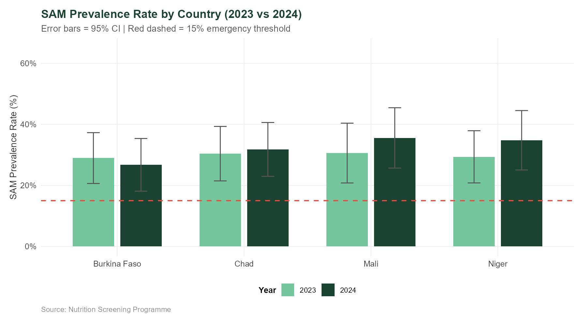

#### Figure 09 — Relation MUAC vs Âge

```r
Rnutr_sample <- nutrition %>% sample_n(400)

p9 <- ggplot(nutr_sample, aes(x = AgeMonths, y = MUAC_cm, 
                              color = NutritionStatus, shape = Gender)) +
  geom_point(alpha = 0.65, size = 2) +
  geom_smooth(aes(group = NutritionStatus), method = "lm", se = FALSE, linetype = "dashed") +
  scale_color_manual(values = PAL_NUTR) +
  labs(title = "MUAC vs Age by Nutrition Status",
       x = "Âge (mois)", y = "MUAC (cm)") +
  theme_meal()

save_fig(p9, "09_muac_age_scatter", w = 10, h = 6)

```
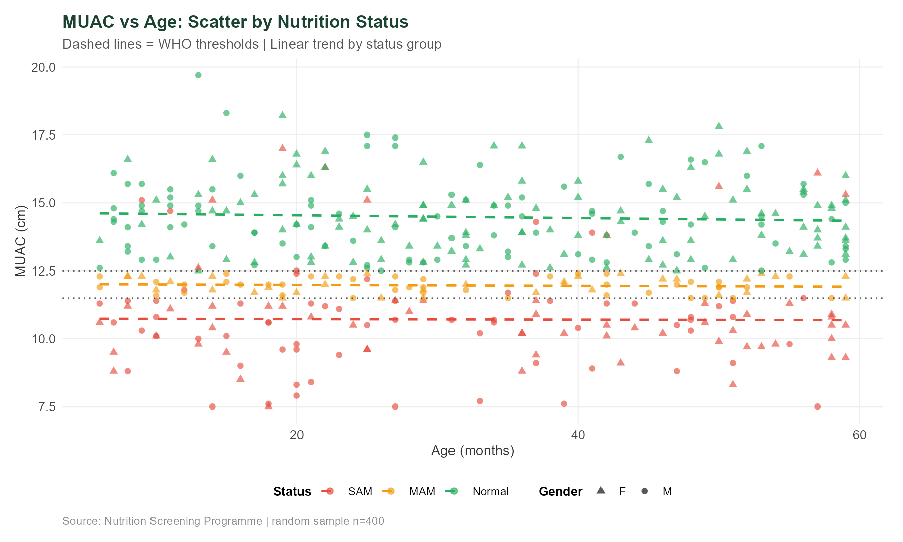

#### Section 4 — Redevabilité (Accountability)
#### Figure 10 — Temps de résolution selon la sévérité

```r
Rp10 <- ggplot(resolved, aes(x = Severity, y = DaysToResolve, fill = Severity)) +
  geom_violin(alpha = 0.6, trim = TRUE) +
  geom_boxplot(width = 0.2, fill = "white", outlier.shape = NA) +
  geom_jitter(width = 0.08, alpha = 0.3, size = 1.5) +
  labs(title = "Feedback Resolution Time by Severity",
       subtitle = "Violin + Boxplot + Points individuels",
       y = "Jours pour résoudre") +
  theme_meal() +
  theme(legend.position = "none")

save_fig(p10, "10_resolution_time", w = 9, h = 5.5)

```
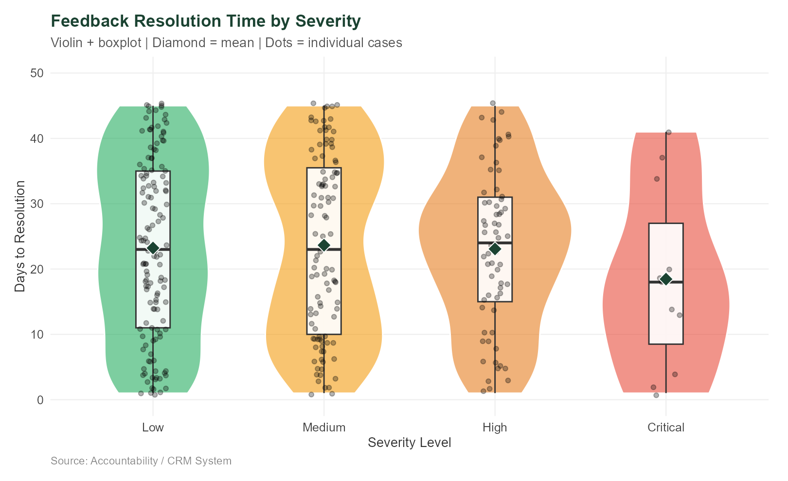

#### Figure 11 — Taux de résolution par type et canal

```r
Rresolution_rate <- accountability %>%
  group_by(FeedbackType, Channel) %>%
  summarise(rate = mean(Resolved == "Yes"), .groups = "drop")

p11 <- ggplot(resolution_rate, aes(x = Channel, y = rate, fill = FeedbackType)) +
  geom_col(position = position_dodge(0.75), width = 0.65) +
  geom_text(aes(label = percent(rate, accuracy = 1)),
            position = position_dodge(0.75), vjust = -0.4, size = 2.8) +
  scale_y_continuous(labels = percent_format(), limits = c(0, 1.05)) +
  labs(title = "Resolution Rate by Feedback Type and Channel") +
  theme_meal() +
  theme(axis.text.x = element_text(angle = 30, hjust = 1))

save_fig(p11, "11_resolution_by_channel", w = 11, h = 6)

```
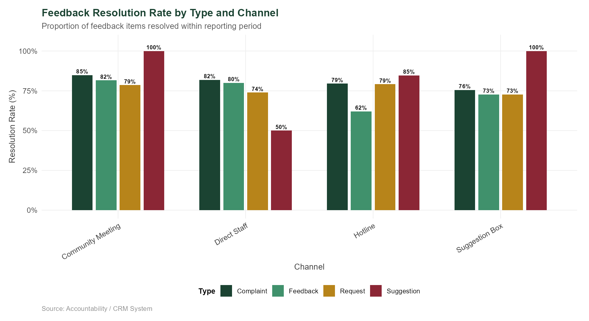

#### Section 5 — Tests Statistiques
#### Figure 12 — Coefficients de la régression linéaire (MUAC ~ Âge + Genre + Pays)

```r
Rp12 <- ggplot(lm_plot_data, aes(x = estimate, y = reorder(term, estimate),
                                color = Significant, shape = Significant)) +
  geom_vline(xintercept = 0, linetype = "dashed", color = "#888888") +
  geom_errorbarh(aes(xmin = conf.low, xmax = conf.high), height = 0.25) +
  geom_point(size = 4) +
  scale_color_manual(values = c("TRUE" = "#1B4332", "FALSE" = "#AAAAAA")) +
  labs(title = "Regression Coefficients: MUAC ~ Age + Gender + Country",
       subtitle = "Points = estimation | Barres = IC 95%",
       x = "Coefficient Estimate (cm)") +
  theme_meal()

save_fig(p12, "12_regression_coefficients", w = 10, h = 5.5)

```
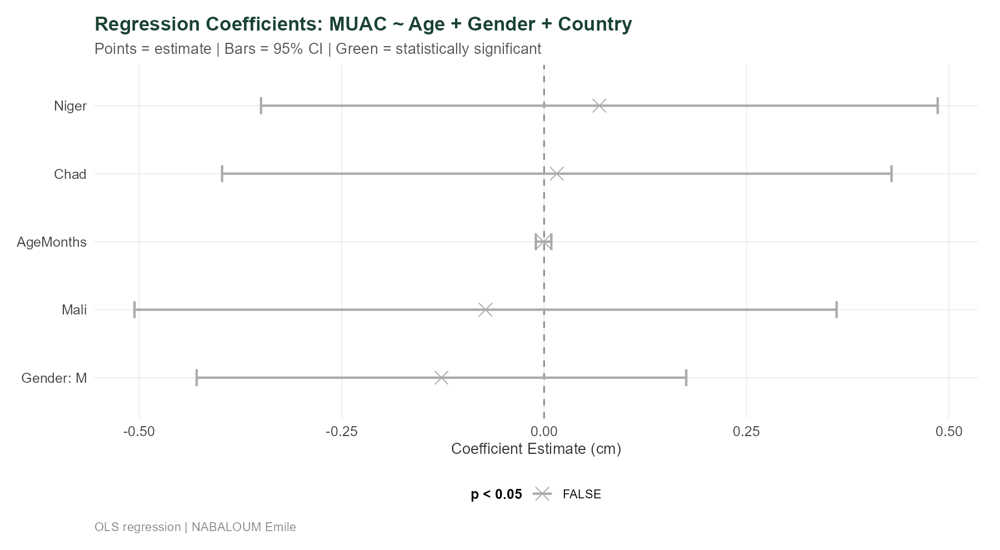

#### Dashboard Composite
#### Figure 00 — Tableau de bord MEAL (6 panneaux avec patchwork)

```r
Rdashboard_panel <- (mini_sector | mini_muac) / (mini_vuln | mini_res) +
  plot_annotation(
    title = "MEAL Impact Dashboard — Sahel Humanitarian Programmes (2023–2024)",
    subtitle = "Portfolio Project | NABALOUM Emile",
    theme = theme(plot.title = element_text(size = 16, face = "bold"))
  )

save_fig(dashboard_panel, "00_dashboard_panel", w = 14, h = 9)
```

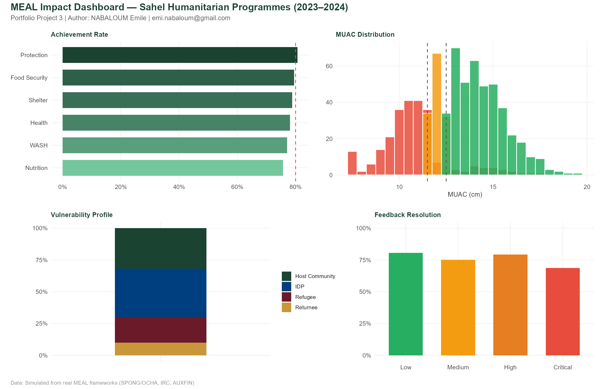


#### 🚀 Comment exécuter le projet
#### Option A — R (recommandée)
Rinstall.packages(c("tidyverse", "scales", "lubridate", "ggtext", "patchwork", 
                   "viridis", "gt", "broom", "ggrepel", "jsonlite", "zoo"))

setwd("project3_meal_r")
source("R/meal_analysis.R")

#### 📂 Structure du projet
Bashproject3_meal_r/
├── R/
│   ├── meal_analysis.R          # Analyse complète
│   └── meal_report.Rmd
├── data/                        # 4 fichiers CSV
├── output/
│   └── figures/                 # Toutes les figures PNG
├── generate_figures.py
└── README.md
